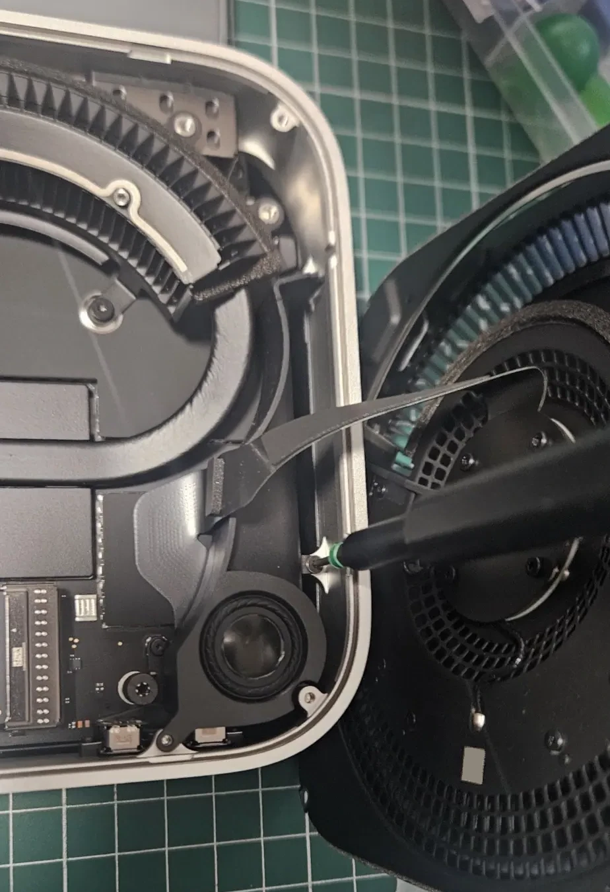
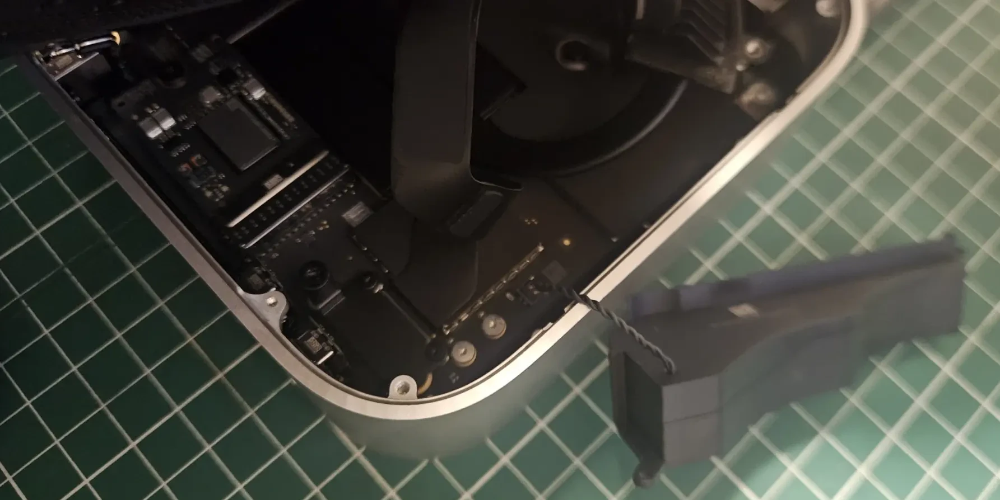
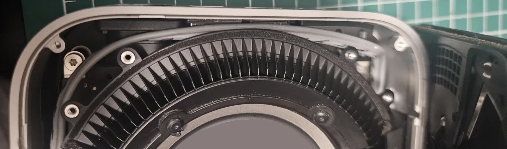
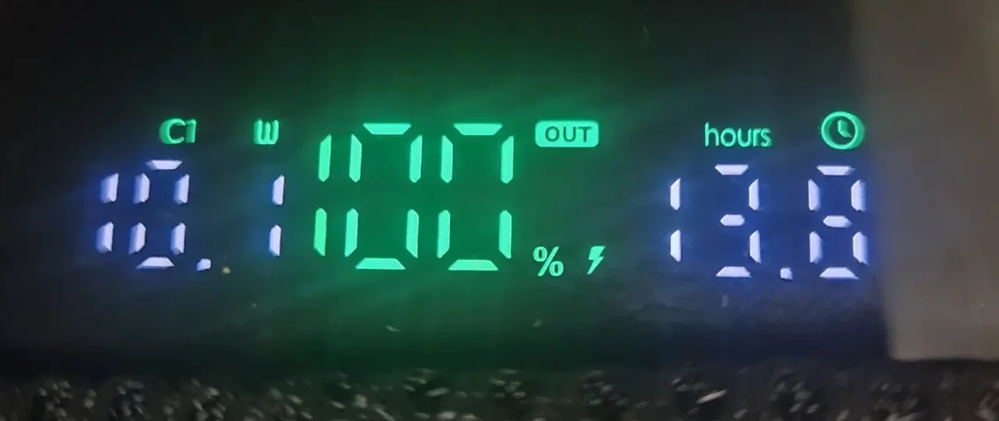

# Hackbook M4 Mini

This repo documents the process required to hack an Apple M4 Mac Mini to power from USBC.

It makes an awesome 12V computer.

Typical draw is 0.6A, with >1A peaks.

Scenarios where this could be useful:
 * If non-square screens on Macbook Pros make your blood boil with rage
 * If you can't afford or don't want to pay for a Macbook Pro (smart choice)
 * If you have ergonomics concerns with shrinking laptops and one size fits all keyboards
 * If you like your systems to be repairable and modular rather than comprised of proprietary parts shoehorned in to a closed source design available only from a single vendor for a limited time
 * If you are blind (and don't want to carry a screen around)
 * If you want to use AR instead of a screen and therefore prefer to be untethered
 * If you are on a sailing ship, submarine, mobile home, campervan, paraglider, recumbent touring bicycle, or otherwise off-grid
 * If you want a capable unix system to power a mobile mechatronic system

The process is essentially the same as that described by [@mikegyverComputer](https://www.youtube.com/@mikegyverComputer) in his [power hack video](https://www.youtube.com/watch?v=-ZEwCB1UCIY) and [usbc power upgrade video](https://www.youtube.com/watch?v=PUqhrr-sxaM).

## Warning

Don't try this if you are uncomfortable breaking your computer. If you are unfamiliar with electronics it will be quite likely that you break it, and it is more than possible that it never starts again. That would be a waste of good hardware.

## While you're at it

If you really want to upgrade your system consider buying a larger SSD from [Amazon sellers](https://www.amazon.com/sbaceflay-Mini-Hard-Disk-Upgrade/dp/B0DYJ2FQYG). Note that this [requires reflashing your Mac](https://support.apple.com/en-us/108900) which itself requires a second Mac, so ensure you have one on hand!

## Tools required

You will need:
 * Apple security T4 star screwdriver (available in many sets these days)
 * Thin wedge for opening the case (I used two el-cheapo philips head screwdrivers, after the plastic triangle thinggies proved too fat for the job)
 * USBC PD dongle (I used [this one from Amazon](https://www.amazon.com.au/dp/B0DKNK3MD8)) but they mostly seem to use the same unmarked Chinese USB PD client chipset so are probably all mostly equivalent. Mine could source 12V @ 3.7A  
 * A short length of two cables that are able to carry 4A safely (22AWG = 0.644mm diameter, or better), around 20-30cm for each of the two cables.
 * Patience for fiddly work
 * A soldering iron
 * Perferably a heat gun, otherwise a cigarette lighter or fast-moving soldering iron for heat shrink activation
 * Some scissors, snips or clippers for cable finishing
 * Optionally, a wire stripping tool (if you can't do it with scissors)
 * A set of fine needle-nose tweezers for retrieving, placing and orienting screws
 * Some large heat shrink (preferable), electrical tape or thin plastic wrap
 * A large anti-static mat for your workspace
 * Two small saucers or other containers to ensure you don't lose any screws

## Process

 * __Unplug the computer__. There should be zero cables connected.
 * __Flip over the computer__, placing it gently on the anti-static mat or other non-scratching work surface. The black plastic under should face upwards, and the aluminium should face down.  
 * __Open the computer__. This requires inserting fine wedges in to the gap between the machined and anodized aluminium case and the black plastic. I use two small philips head screwdrivers. Place them both in nearby each other (~1.5cm space between) then gently flip upward. The plastic will pop out. Work your way around carefully and pop the plastic out fully.
 * __Carefully tip back the cover__. The corner will have a power cable connected. You can leave this connected, just ensure there is no pressure applied to the cable and you will be fine.   
 * __Undo the top layer of screws holding the vent in place__. These are quite numerous, with eight in total. Place these in a small saucer or other container to ensure they are not lost.   
 * __Carefully tip back the vent layer__. There is a cable which connects the vent layer to the rest of the computer, be careful not to strain this.  
 * __Undo the second layer of screws holding the central element in place__. There are two sets here. Two screws holding the upper lip which are short, and two scres holding the lower portion which are longer, complex in shape and contain tapers and a three distinct width shaft. Place these separately to the other screws in a separate container.    
 * __Remove the central element carefully__, tipping it over the edge so that you do not have to disconnect it.
 * __Identify the corner with the black corner element__, then undo those screws (3x) and place separately. This unit once more contains a power cable and must be handled carefully. Insertion and removal is quite difficult for this part, be careful not to damage it or tear the cable. Once removed, tip it over the edge so that you can see the board below.      
 * __Now identify the two power riser screws with adjacent test pads__. These are the main rail supplying power to the system. The one closest to the corner is positive 12V, and the other one is negative (0V).   
 * __Observe the required cable route__. The two cables must run from those power riser screws to the exterior of the system. In order to do this without punching holes in too many layers, it's necessary to run them around the edge of the case (left to the corner with the vertical void that is not covered by the corner piece you have just removed), then upward, then around one more edge of the case (which is hard to do as they must be tucked under things), then upward to the plastic section (which requires making some holes).   
 * __Select appropriate cable in appropriate lengths__. You want cable that can carry 4A (22AWG / 0.644mm diameter, or better) but no thicker than necessary as it will be hard to route and reduce airflow. The length should be enough for the full cable run along two sides of the unit plus some vertical rise plus some spare (but not too much) to connect and solder to the USBC power delivery (PD) PCB.
 * __Strip the cables on their interior end__. The stripped length should be equal to the diameter of the riser screws' internal shaft so that a 'U' can be formed around it to enhance the amount of connection between the cable core and the screw to better transfer current with a minimum of resistance.
 * __Bend the stripped cable ends in to the target 'U' shape__. For this purpose I like to use the shaft of the T4 screwdriver bit. You want the bend to begin some distance from the cable sheath so that the screw is not inhibited by the sheath.    
 * __Route the cables from the vertical void corner in to the riser screws behind all other elements__. Push them down beneath the elements present in the case interior so that they do not inhibit the re-installation of other elements or fixing screws and are held generally in place as they approach the riser screws.  
 * __Check the cable positions__. If your cables are joined in to a two-core cable you will need to shorten the negative cable in order to easily screw it in to place. Adjust this as necessary.  
 * __Consider heat shrink__. If you have stripped too much cable or feel there is too much exposed, add some heat shrink to the cable before fixing it in place.
 * __Fix the cables in place__. This can be very fiddly. It helps greatly to have a fine pointed set of tweezers to assist with placement, bending and the application of pressure whilst screw-down is underway. Take your time and try to get all the cable core under the screw or at least a fair amount.   
 * __Consider hot glue, nail polish or similar insulator__. This can be applied to the cable cores around the screws to prevent individual strands from fraying and becoming loose within the enclosure, potentially causing a catastrophic short.
 * __Re-assemble the computer__ by reversing the process, leaving off the final vent layer.
 * __Optionally test the computer with a bench supply__. This requires you have a bench supply capable of supplying 12V at probably 2A or greater. If it turns on, you are in business. If not, turn it off, reverse the assembly, trace back and resolve your issues.
 * __Separately to the computer, test the USBC power distribution (PD) PCB__. This means place a multimeter on the + and - output terminals, and plug it in to a USBC PD capable power source. If you get between 12V and 13V, you're in business. If not, fiddle until you do. If you have a DC electronic load, you can use this to test the maximum draw. The USB PD PCBs I bought required a solder blob to configure 12V output (they were 5V out by default, despite seller claims otherwise) but then supplied happily up to 3.7A. Supply 3.8A would shut down the output of the USB PD source, which may have been a safety trigger in the source rather than a limitation of the USBC PD PCB. Roughly, 12V * 3.7A = 45W. My USB PD source claims 140W support on one port, and 40W support on a second port, however both ports had the same load cutoff, whether this was a propery of the USBC PD battery or the PCB client remains unknown. Regardless, that's well over the 3A that [@mikegyverComputer](https://www.youtube.com/@mikegyverComputer) said worked fine for him. He describes Apple hardware as 'over-engineered' such that a wide range of input voltages will be tolerated without problem, which is good news.
 * __Place a large piece of heat shrink on the power cable__. This will be used to enclose the entire USBC PD PCB and its soldered cable connections.    
 * __Calculating the final position of the USBC PD PCB in the vent portion of the chassis, cut the cable to length and solder the ends to the USBC PD PCB output terminals__. You may need to create a hole in the vent assembly. I used some snips and did not require other tools. The PCB sat nicely without the need for glue.    Initial snip.    Second snip.   
 * __Finally, reassemble the vent layers and close the case entirely__. You should now have a USB power port to run your Hackbook M4 Mini from battery!    

## Battery selection

I bought the [iNiu 140W 25000mAh power bank](https://www.amazon.com.au/dp/B0CB1CCQ5P) based on the positive experience I had with a previous iNiu device.

## Longevity

According to the battery, I can run the Hackbook M4 Mini with my [18.5" portable screen](https://www.amazon.com.au/dp/B0CSD5Y24N) at full brightness for 8.5 hours, or at minimum brightness for 13.5 hours.

## Previous projects / points of reference

 * About 10 months ago Hackaday reported on [Scott Yu-Jan's macintosh mini](https://hackaday.com/2025/03/25/designing-a-portable-mac-mini/#more-769147) which was an AC output power bank powering a previous generation (m3?) mac mini and an iPad.
   * Battery: $160 for ~20k mAh vs our $65 ~24k mAh .. yeah nah
   * Power path: Additional overhead and losses from the battery DC - interter AC output - mac mini AC input to internal DC power conversion path
   * Weight: Heavy inverter hardware
   * Form factor: Impossible to fit in a backpack = not very practical
   * Longevity: 3 hours = ~50% battery use, ~6 hours max vs. our nominal 4+ hours (full brightness) or 6.75 hours (low brightness) ... yeah nah
   * Screen size: mini ipad vs. our 18.5" ... yeah nah
